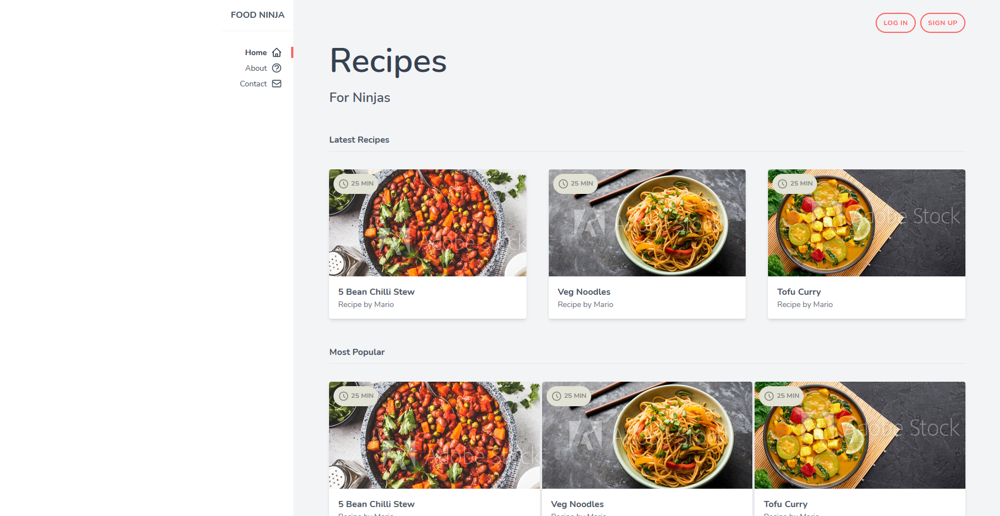

# Tailwind css tutorial

Learn framework Tailwind CSS. You can see my result here. This is simple landing page with different pizza recipies.

You can try yourself [here](https://bodamat.github.io/tailwind-css-tutorial/)
